# aws-s3-lambda-dynamodb-pipeline

## 🎯 Project Objective

The purpose of this project is to demonstrate an event-driven architecture in AWS.

Whenever a file is uploaded to an S3 bucket, it automatically triggers a Lambda function, which processes the event and stores file details into a DynamoDB table.

After uploading a file, a new item (record) is created in the DynamoDB table containing file metadata such as file name, size, event type, and timestamp.

---

## 🧠 Architecture

S3 (Upload File) → Lambda (Process Event) → DynamoDB (Store Data)

---

## 🛠️ Services Used

- AWS S3  
- AWS Lambda  
- AWS DynamoDB  
- AWS IAM  

---

## 🔹 Step 1: Create IAM Role

Go to AWS Console and open IAM service.

- Select AWS service → Lambda  
- Attach permissions:
  - AmazonS3FullAccess  
  - AmazonDynamoDBFullAccess  
- Give role name: **Lambda function**  
- Create role  

👉 This role allows Lambda to securely access S3 and DynamoDB.

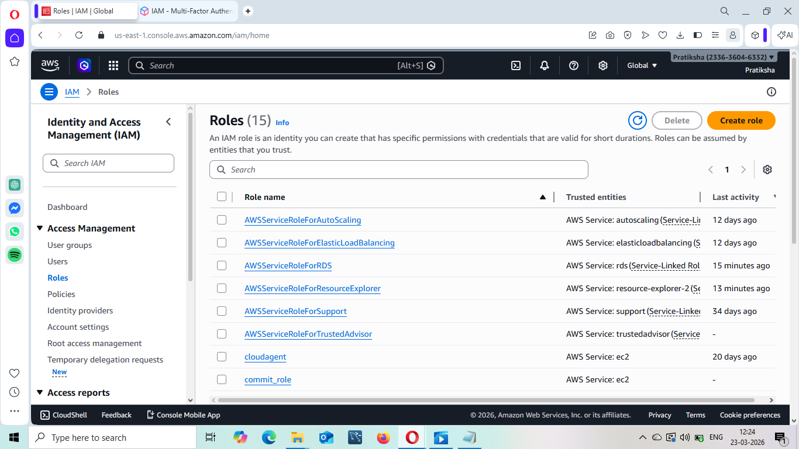
)

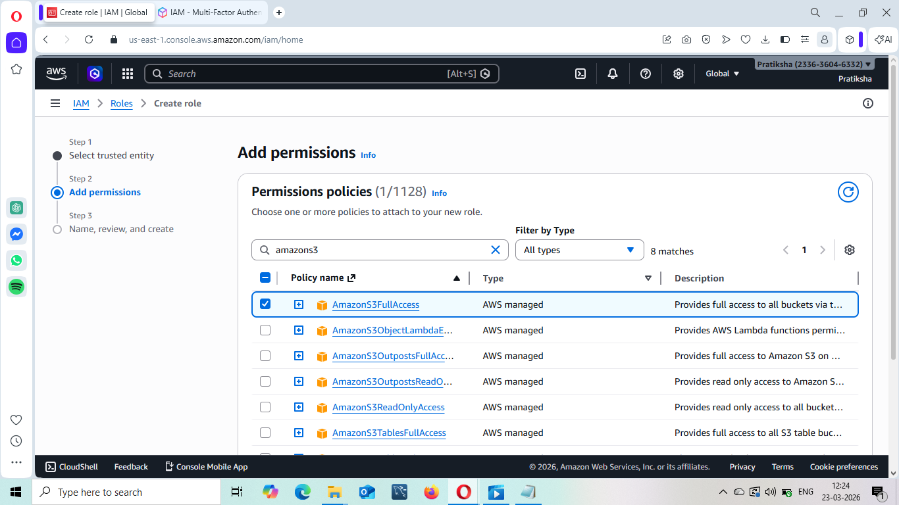

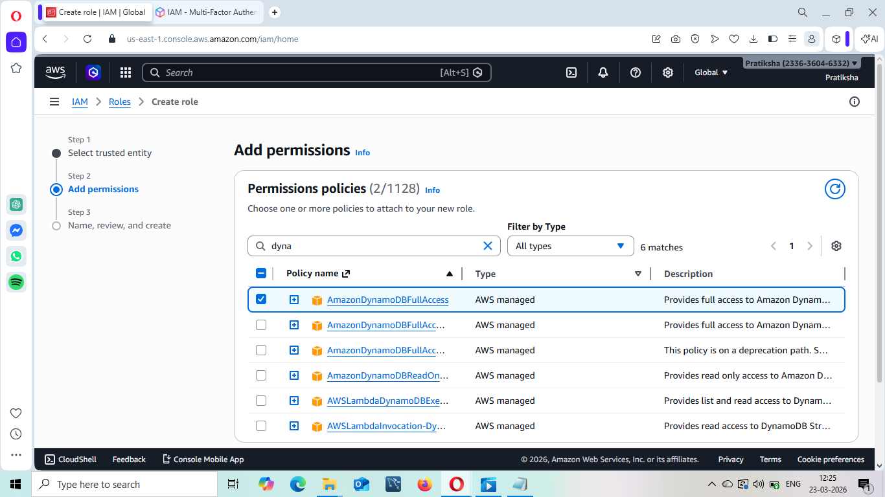

---

## 🔹 Step 2: Create Lambda Function

Go to Lambda service and create a new function.

- Select runtime: Python  
- Choose **Use existing role**  
- Select the IAM role created earlier  

👉 Lambda is a serverless service that runs automatically when triggered.

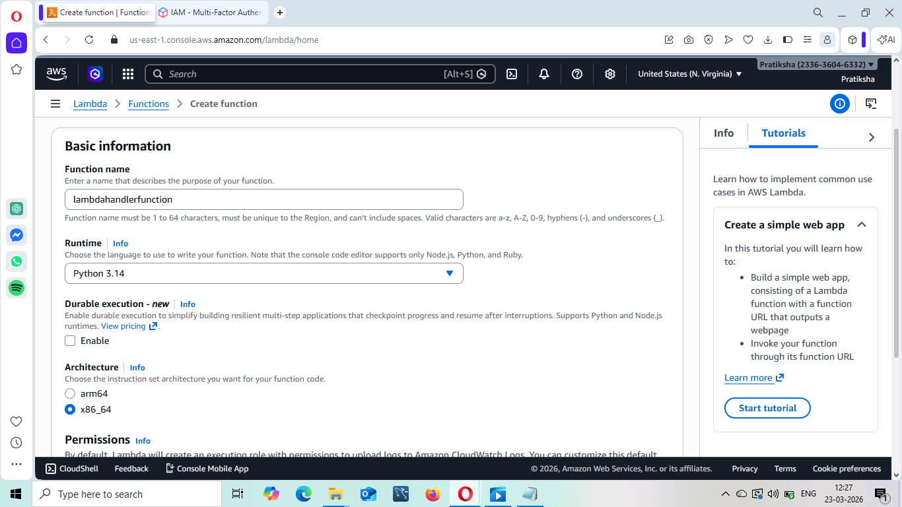
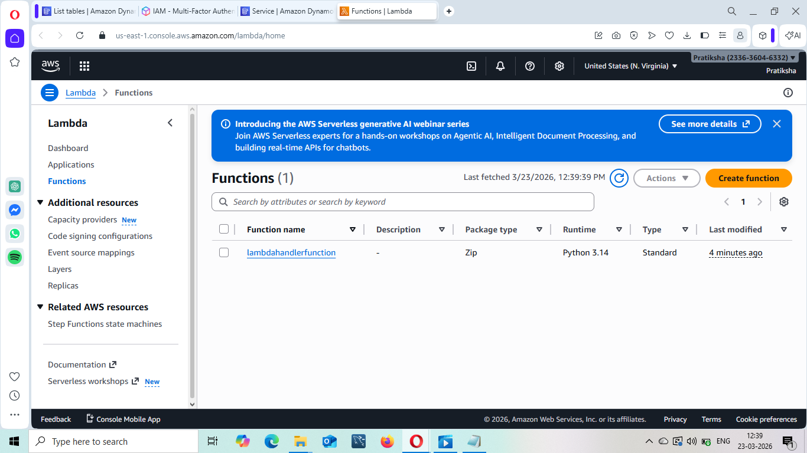
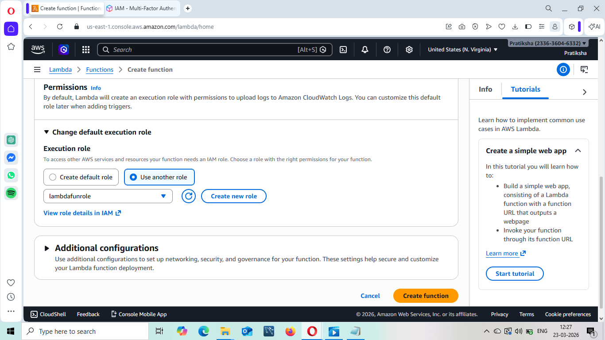

---

## 🔹 Step 3: Configure Lambda Function

- Open the function  
- Add your Python code  
- Save the function  

👉 This code processes S3 events and sends data to DynamoDB.
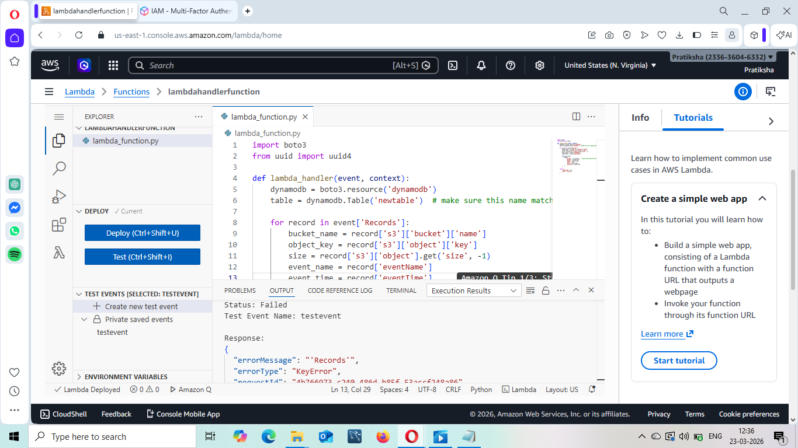

---

## 🔹 Step 4: Create S3 Bucket

Go to S3 and create a new bucket.

👉 This bucket will store files and trigger Lambda.

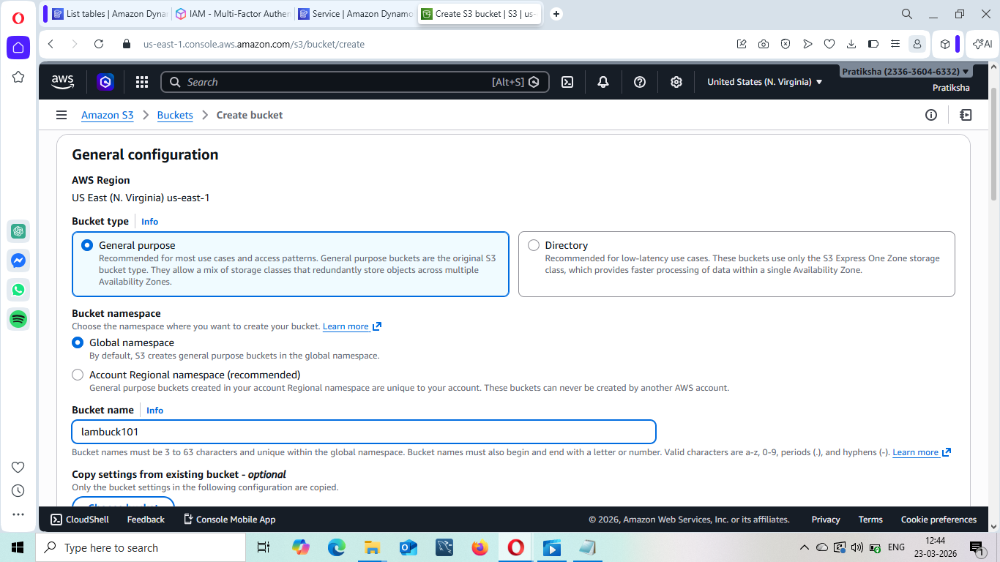

---

## 🔹 Step 5: Add S3 Trigger to Lambda

- Go to Lambda → Add Trigger  
- Select S3  
- Choose your bucket  
- Select event types:
  - PUT  
  - POST  
  - DELETE  
  - Delete Marker Created  

👉 This connects S3 with Lambda.

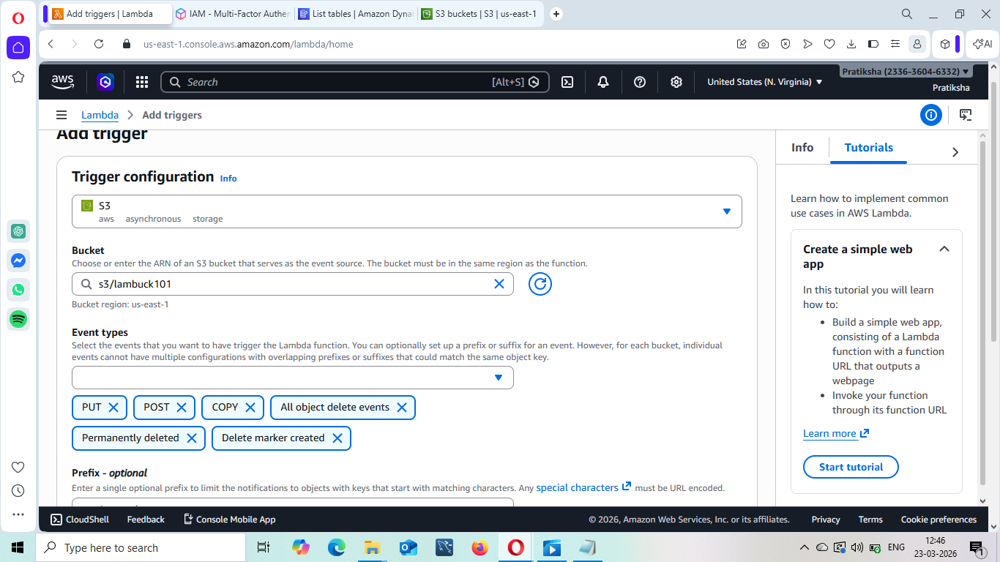

---

## 🔹 Step 6: Create DynamoDB Table

Go to DynamoDB and create a table:

- Table name: **newtable**  
- Partition key: **unique (String)**  

👉 This table stores file metadata.

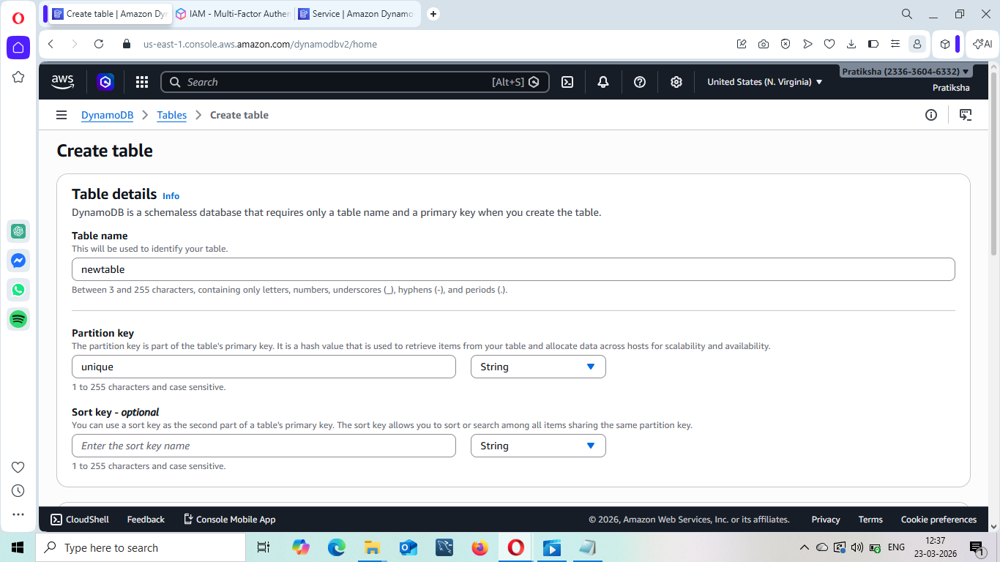

---

## 🔹 Step 8: Test the System

- Upload a file to S3 bucket  
- Lambda will trigger automatically  
- Data will be stored in DynamoDB  

---

## ✅ Output

When a file is uploaded:

- Lambda is triggered automatically  
- A new item is created in DynamoDB  
- It contains:
  - Bucket name  
  - File name  
  - File size  
  - Event type  
  - Timestamp  

👉 This confirms the system is working correctly.

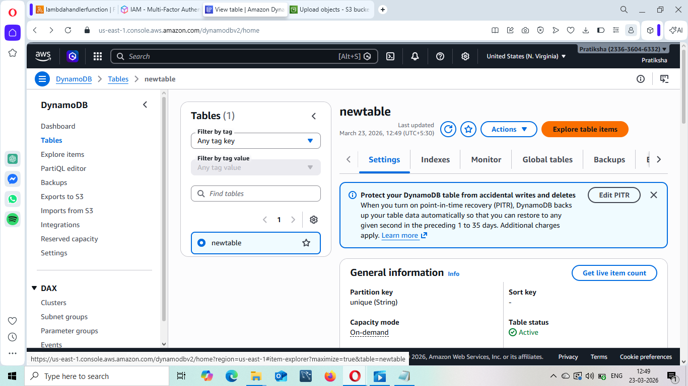
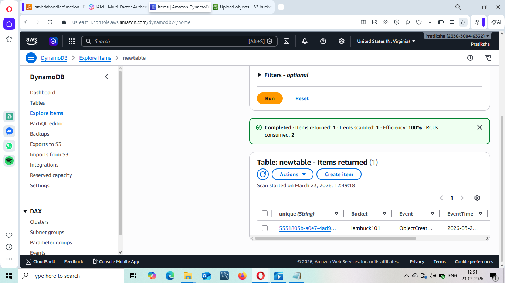

---

## 🎯 Conclusion

This project demonstrates how AWS services work together to create a serverless, event-driven system that automatically processes and stores data without manual intervention.
